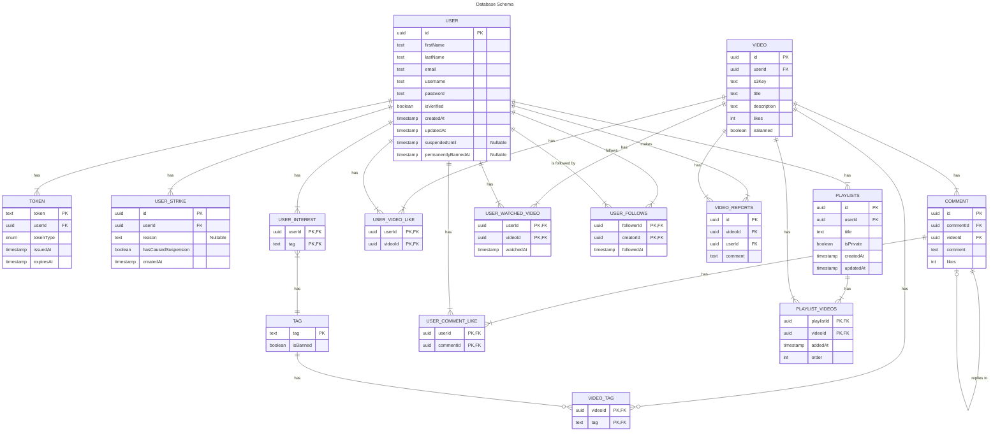

```mermaid
---
title: Database Schema
---
erDiagram
  USER ||--|{ TOKEN : has
  USER ||--|{ USER_STRIKE : has
  USER ||--|{ USER_INTEREST : has
  USER {
    uuid id PK
    text firstName
    text lastName
    text email
    text username
    text password
    boolean isVerified
    timestamp createdAt
    timestamp updatedAt
    timestamp suspendedUntil "Nullable"
    timestamp permanentlyBannedAt "Nullable"
  }
  TOKEN {
    text token PK
    uuid userId FK    
    enum tokenType
    timestamp issuedAt
    timestamp expiresAt
  }
  USER_STRIKE {
    uuid id PK
    uuid userId FK
    text reason "Nullable"
    boolean hasCausedSuspension
    timestamp createdAt
  }
  USER_INTEREST }|--|| TAG : has
  USER_INTEREST {
    uuid userId PK, FK
    text tag PK, FK
  }
  VIDEO ||--o{ VIDEO_TAG : has
  TAG ||--o{ VIDEO_TAG : has
  TAG {
    text tag PK
    boolean isBanned
  }
  VIDEO {
    uuid id PK
    uuid userId FK
    text s3Key
    text title
    text description
    int likes
    boolean isBanned
  }
  VIDEO_TAG {
    uuid videoId PK, FK
    text tag PK, FK
  }
  VIDEO ||--|{ USER_VIDEO_LIKE : has
  USER ||--|{ USER_VIDEO_LIKE : has
  USER_VIDEO_LIKE {
    uuid userId PK, FK
    uuid videoId PK, FK
  } 
  COMMENT ||--|{ USER_COMMENT_LIKE : has
  USER ||--|{ USER_COMMENT_LIKE : has
  USER_COMMENT_LIKE {
    uuid userId PK, FK
    uuid commentId PK, FK
  }
  VIDEO ||--|{ COMMENT : has
  COMMENT ||--o| COMMENT : "replies to"
  COMMENT {
    uuid id PK
    uuid commentId FK
    uuid videoId FK
    text comment
    int likes
  }
  VIDEO ||--|{ USER_WATCHED_VIDEO : has
  USER ||--|{ USER_WATCHED_VIDEO : has
  USER_WATCHED_VIDEO {
    uuid userId PK, FK
    uuid videoId PK, FK
    timestamp watchedAt
  }
  USER ||--|{ USER_FOLLOWS : follows
  USER_FOLLOWS }|--|| USER : "is followed by"
  USER_FOLLOWS {
    uuid followerId PK, FK
    uuid creatorId PK, FK
    timestamp followedAt
  }
  USER ||--|{ VIDEO_REPORTS : makes
  VIDEO ||--|{ VIDEO_REPORTS : has
  VIDEO_REPORTS {
    uuid id PK
    uuid videoId FK
    uuid userId FK
    text comment
  }
  USER ||--|{ PLAYLISTS : has
  PLAYLISTS ||--|{ PLAYLIST_VIDEOS : has
  VIDEO ||--|{ PLAYLIST_VIDEOS : has
  PLAYLISTS {
    uuid id PK
    uuid userId FK
    text title
    boolean isPrivate
    timestamp createdAt
    timestamp updatedAt
  }
  PLAYLIST_VIDEOS {
    uuid playlistId PK, FK
    uuid videoId PK, FK
    timestamp addedAt
    int order
  }
```